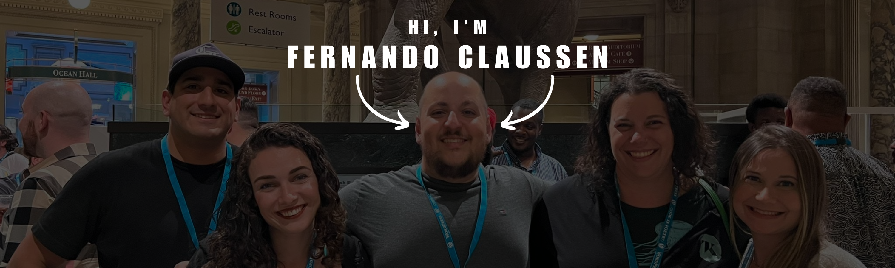

<h1 align="left"> Hello there, I'm Fernando</h1>

  <em>Director of Engineering at <a href="https://www.trewknowledge.com">Trew Knowledge</a> </em>  
  
  
    
  My goal is to help make the developer experience a pleasant one. 
  I believe we can empower a whole generation of new developers by properly documenting our learnings and code.
  
  🔭 I’m currently working on <strong>AI tools, processes and documentation</strong>
  
  📝 I sometimes write articles on <a href="https://fernandoclaussen.com">fernandoclaussen.com</a>

## Trophies

)

